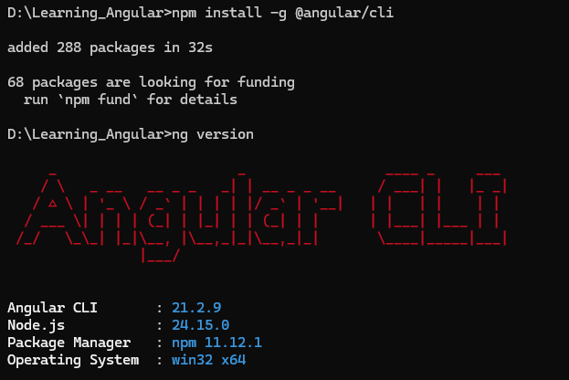
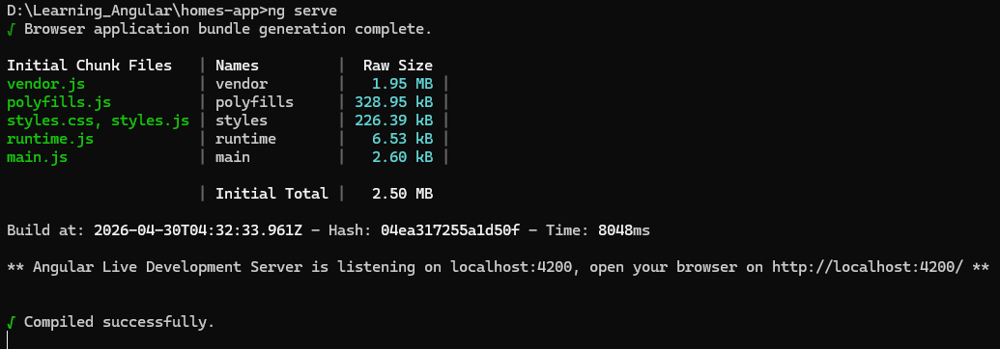
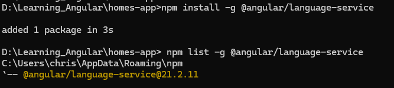
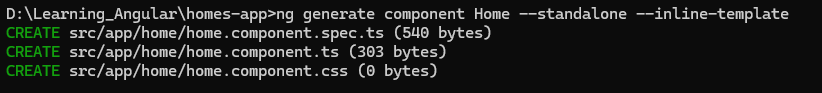

# Learning_Angular
This is my first learning project of Angular

## Reference from Youtube
Getting started with Angular - Learning Angular - by Angular
https://youtube.com/playlist?list=PL1w1q3fL4pmj9k1FrJ3Pe91EPub2_h4jF&si=hp7CD_9egckQJ0oi 

## Notes : Introduction to Angular
1. What is Angular? 
 - it is a platform for building single page client applications using HTML and TypeScript 
 - It provides the tools and libraries needed to create rich interactive web applications
 2. What is Angular App?    
 - it is a client side application that runs in the browser
 - it can be used to create rich interactive web applications 
 3. What is a Component?
 - It is a building block of Angular application
 - It is a class that is associated with a template
 - It is a class that is associated with a stylesheet

 4. Why Angular?
 - It focus on developer tooling and productivity
 - Angular has a built-in router and HttpClient module
 - Easy updates
 - Uses TypeScript

 5. what is TypeScript?
 - It is a strongly typed programming language that is a superset of JavaScript
 - It is developed by Microsoft
 - It is statically typed language  

## Getting Started with Angular 

 1. Install Node.js and npm
 - Node.js is a JavaScript runtime environment that is used to run Angular applications
 - npm is a package manager for Node.js that is used to install Angular applications

 2. Install Angular CLI
 - Angular CLI is a command line interface for Angular applications
 - It is used to create, develop, and maintain Angular applications

 ### How to install Angular CLI
 ```bash
 npm install -g @angular/cli
 ```
 ### How to confirm that Angular CLI is installed
 ```bash
 ng version
 ```    
Image of the output:


## Setting up your project

1. In this tutorial we will be downloading an existing project from;

https://github.com/angular/codelabs/tree/homes-app-start

2. Download - extract and rename the folder as homes-app

3. Open terminal or command prompt and navigate to the homes-app folder

```bash
cd homes-app
```
4. Install all the dependencies

```bash
npm install
```

5. Testing out the application using a development server hosted on your computer and provided by angular

```bash
ng serve
```
Image of the output:


It will run on `http://localhost:4200`

6. Install Angular language service
```bash
npm install -g @angular/language-service
```
check whether the language service is installed
```bash
ng language-service
```
screenshot:


## Identifying files in the Project

### angular.json
 This file contains the configuration for the Angular application

### src directory
 It contains the source code of the Angular application

 - Can update hello world in app.component.ts file
 - It will be updated in the browser    

## Components in Angular

### Typescript Component Class
- Builds the application Logic
- API calls for data
- Event handlers

### Component Template (HTML)
- Defines the structure of the component
- Defines the content of the component
- Defines the layout of the component

### Component Stylesheet (CSS)
- Defines the styles of the component
- Defines the look of the component
- Defines the feel of the component

## Start coding app.component.ts
- add a header into component template - at this point the logo

### Creating a component

1. Using Angular CLI create a component (in this case a home component)

```bash
ng generate component Home --standalone --inline-template
```
-Note:
  - Standalone Components: Components that can be used independently of Angular Modules. They are defined by using the `standalone: true` option in the component decorator. Standalone components are the recommended way to create components in Angular 14 and later. 
  - Inline Template: A template that is defined in the component decorator itself.  

2. Output gives which files are created and were they are created



3. Update app.component.ts to reference our new component - in a section tag the component is refered as;
```bash
  <app-home></app-home>
``` 
- Note: The name of the component is 'Home' in the app.component.ts file.  Angular automatically converts the component name to kebab-case for use in templates.

- At this point we have to import component and in the home component metadata (@component) we have to add the home component to the imports array

- Now we have 2 components and we can use them in our application 

4. Update the template of home component

5. Create a new component like previous called HousingLocation and import it to home component 

## Customizing Components

1. Update the component template in housing location component

2. Create an interface for the housingLocation data through Angular CLI and add the types of data to the interface.

```bash
ng generate interface housingLocation
```
3. Use input properties to pass data to the component and use the interface to know what kind of data to expect.

Notes:
  - used interpolation to display data in the template
  - 

4. Working with the list of locations in home.coponents.ts

    # Iteration over data using ngFor

    ```bash
    <section class="results">
      <app-housing-location *ngFor="let housingLocation of housingLocationList"></app-housing-location>
    </section>
    ```
     # Passing the housing location list to the housing location component
    ```bash
    <app-housing-location *ngFor="let housingLocation of housingLocationList" [housingLocation]="housingLocation"></app-housing-location>
    ```    
5. Copy paste styles from https://gist.github.com/MarkTechson/fa601fdc856d26b3bfa5030dae147f00 to app.component.css

## Routing

Herewe are have implemented the navigation from home component to the details component using routing.

1. Enable routing in the application
 In main.ts file import provideRouter function from @angular/router and also import the routes array.
 
2. To create routes.ts file under src/app folder 
 - Import the routes array from @angular/router
 - Import the Home and Details components
 - Define the routes array with the path and component to be displayed
 
 3. Update the application to desplay components based on the current rout
  - That done on app.component.ts file by using router and router outlet tags
  
  4. Update the routes.ts by adding path

  5. Update the main.ts to use the routes.ts file

  6. Creating a details component using Angular CLI
  ```bash
  ng g c details --standalone --inline-template
  ```
   - g short form of generate
   - c short form of component
   - standalone is used to create standalone components
   - inline-template is used to create inline templates

   7. For details add an new route to routes.ts file and add a link to the details page to housing-list component

   8. In the housing-location.component.ts Instead of adding a href attribute to the anchor element, In angular we add a router link directive.

    # To identify on which path to route on the housing-location component
    - We can pass data directly to the route
    or
    - Pass some sort of Identifyer via the URL 

    9. Passing an identifier via the url
     - Update the router link to include the id of the housing location
     - Update routes.ts to include the id of the housing location
     - # Here we now use parameterized routers in angular
    
    10. Now update the details component to display the details of the housing location.


  


 

